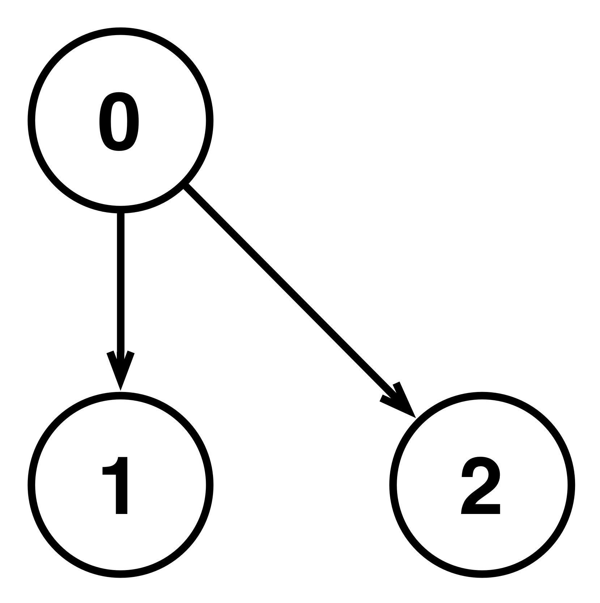
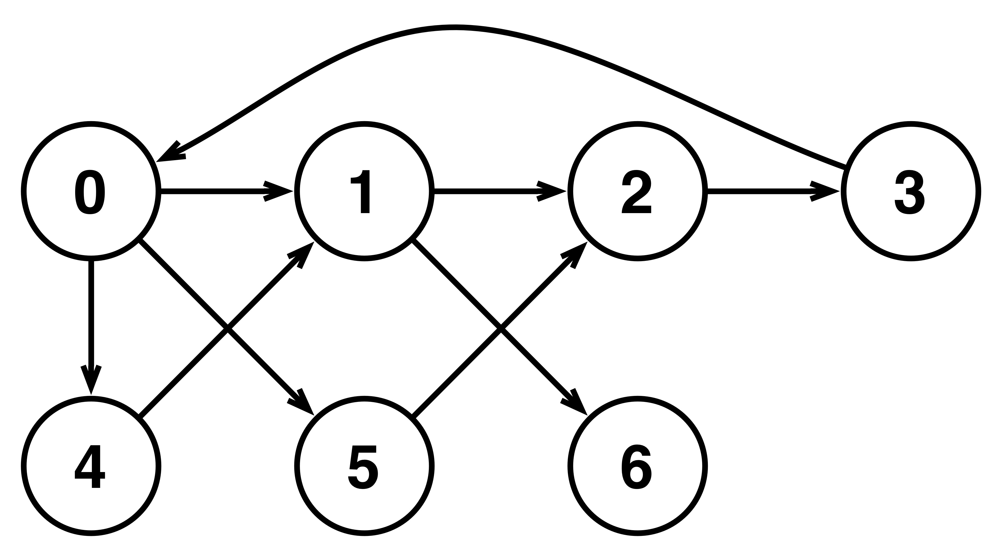
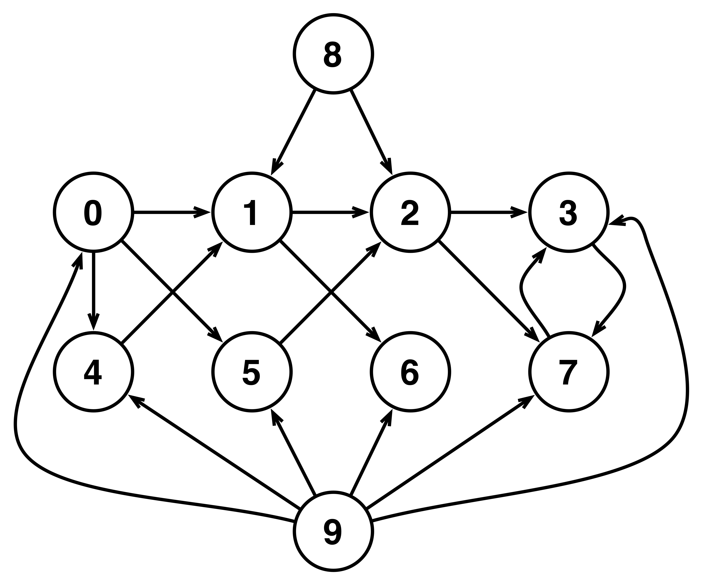

## Graph Basics and Random Digraphs

### Project - Degree distribution for graphs

To gain a more tangible feel for how directed graphs are represented as dictionaries in Python, you will create three specific graphs (defined as constants) and implement a function that returns dictionaries corresponding to a simple type of directed graphs.
For this part of the project, you should implement the following:

- `EX_GRAPH0`, `EX_GRAPH1`, `EX_GRAPH2` - Define three constants whose values are dictionaries corresponding to the three directed graphs shown below. The graphs are numbered 0, 1, and 2, respectively, from left to right. 

```{r test-python0, eval=FALSE, engine='python'}
EX_GRAPH0 = {0 : set([1, 2]), 
             1 : set([]), 
             2 : set([])
            }
```

```{r test-python1, eval=FALSE, engine='python'}
EX_GRAPH1 = {0 : set([1, 4, 5]), 
             1 : set([2, 6]), 
             2 : set([3]),
             3 : set([0]),
             4 : set([1]),
             5 : set([2]),
             6 : set()
            }
```

```{r test-python2, eval=FALSE, engine='python'}
EX_GRAPH2 = {0 : set([1, 4, 5]), 
             1 : set([2, 6]), 
             2 : set([3, 7]),
             3 : set([7]),
             4 : set([1]),
             5 : set([2]),
             6 : set(),
             7 : set([3]),
             8 : set([1, 2]),
             9 : set([0, 3, 4, 5, 6, 7])
            }
```

Note that the label for each node should be represented as an integer. You should use these graphs in testing your functions that compute degree distributions.

- `make_complete_graph(num_nodes)` - Takes the number of nodes `num_nodes` and returns a dictionary corresponding to a complete directed graph with the specified number of nodes. A complete graph contains all possible edges subject to the restriction that self-loops are not allowed. The nodes of the graph should be numbered `0` to `num_nodes - 1` when `num_nodes` is positive. Otherwise, the function returns a dictionary corresponding to the empty graph.
```{r test-python3, eval=FALSE, engine='python'}
def make_complete_graph(num_nodes):
    """
    Takes the number of nodes num_nodes and returns 
    a dictionary corresponding to a complete directed 
    graph with the specified number of nodes.
    """
    if num_nodes > 0:
        graph = {}
        nodes = [n for n in range(num_nodes)]
        for node in range(num_nodes):
            graph[node] = set()
            for edge in nodes:
                if edge != node:
                    graph[node].add(edge)
        return graph
    else:
        return {}
```

For the second part of this project, you will implement two functions that compute the distribution of the in-degrees of the nodes of a directed graph.

- `compute_in_degrees(digraph)` - Takes a directed graph `digraph` (represented as a dictionary) and computes the in-degrees for the nodes in the graph. The function should return a dictionary with the same set of keys (nodes) as `digraph` whose corresponding values are the number of edges whose head matches a particular node.

```{r test-python4, eval=FALSE, engine='python'}
def compute_in_degrees(digraph):
    """
    Takes a directed graph digraph (represented as a 
    dictionary) and computes the in-degrees for the 
    nodes in the graph.
    """
    res = {}
    for node in digraph.keys():
        res[node] = 0
    for indegrees in digraph.values():
        for indegree in indegrees:
            if indegree not in res.keys():
                res[indegree] = 1
            res[indegree] += 1
    return res
```

- `in_degree_distribution(digraph)` - Takes a directed graph digraph (represented as a dictionary) and computes the unnormalized distribution of the in-degrees of the graph. The function should return a dictionary whose keys correspond to in-degrees of nodes in the graph. The value associated with each particular in-degree is the number of nodes with that in-degree. In-degrees with no corresponding nodes in the graph are not included in the dictionary.

```{r test-python5, eval=FALSE, engine='python'}
def in_degree_distribution(digraph):
    """
    Takes a directed graph digraph (represented as a 
    dictionary) and computes the unnormalized distribution 
    of the in-degrees of the graph. 
    """
    indegree = compute_in_degrees(digraph)
    distribution = {}
    for count in indegree.values():
        if count not in distribution.keys():
            distribution[count] = 0
        distribution[count] += 1
    return distribution
```

Note that the values in the unnormalized distribution returned by this function are integers, not fractions. This unnormalized distribution is easier to compute and can later be normalized to sum to one by simply dividing each value by the total number of nodes.


### Application - Analysis of citation graphs

Our task for this application is to analyze the structure of graphs generated by citation patterns from scientific papers. Each scientific paper cites many other papers, say 20-40, and sometimes (e.g., review papers) hundreds of other papers. But, let's face it: It is often the case that the authors of a paper are superficially familiar with some (many?) of the papers they cite. So, the question is: Are the cited papers chosen randomly (from within the domain of the paper) or is there some "hidden pattern"?

Given that we will be looking at "paper i cites paper j" relationships, it makes sense to represent the citation data as a **directed graph** (a citation graph) in which the nodes correspond to papers, and there is an edge from node *i* to node *j* if the paper corresponding to node *i* cites the paper corresponding to node *j*. Since we're interested in understanding how papers get cited, we will analyze the in-degree distribution of a specific graph, and contrast it to those of graphs generated by two different random processes.

